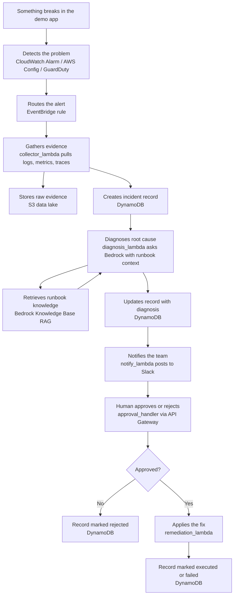
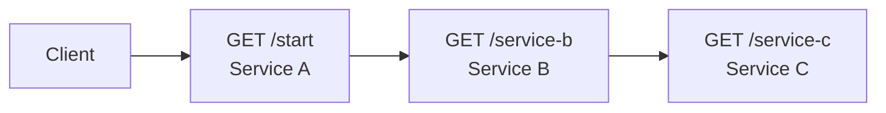

# LLM-Assisted Cloud Incident Response on AWS

A friendly onboarding guide for anyone joining this project. You don't need to
know anything about AWS or "serverless" to read this — we'll explain everything
as we go.

The full engineering spec lives in
[`PROJECT_SPEC.md`](PROJECT_SPEC.md). Read that once you're comfortable here.

---

## What this project does

When something breaks on a cloud application (a server runs out of memory, a
security setting is wrong, one service takes another down with it), this
system is supposed to **notice the problem automatically**, **figure out why it
happened**, **suggest a fix**, and — only with a human's permission — **apply
the fix**.

The "figuring out why" part is done by an AI model (a large language model,
same family of technology as ChatGPT), pointed at real data about the failure
instead of being asked to guess.

Everything it does is written down in a database as a **structured record**, so
after the fact we can score how accurate it was, how fast it was, and whether
it made things up. That scoring is the research part of this project — we're
building this for an academic paper.

---

## How it works (the flow)

Here's the whole pipeline, from "something broke" to "we fixed it and logged
everything."



The simple version: **detect → collect evidence → diagnose with AI → notify a
human → get approval → fix it → log everything.**

---

## Tech stack explained

Each row is one AWS service (or tool) we use. "AWS" is Amazon's cloud platform —
think of it as renting computers and utilities instead of buying your own.

| Service | What it does in this project | Why we're using it |
|---|---|---|
| **AWS SAM** | A tool that describes our entire backend in one config file (`template.yaml`) and deploys it with one command. | So the whole system is reproducible from code — no clicking around in the AWS website. |
| **Lambda** | Amazon's service for running small bits of code without managing a server — you just upload a function and it runs when triggered. | All our backend logic (collect, diagnose, remediate, etc.) is a Lambda function — cheap and easy to trigger. |
| **S3** | Amazon's file storage ("buckets" = folders in the cloud). | We store raw incident evidence in a "data lake" bucket, and our runbook docs in another. |
| **DynamoDB** | Amazon's NoSQL database — fast key-value storage. | Every incident becomes a structured record here; this is our evaluation dataset. |
| **EventBridge** | A message router that reacts to "events" (like "an alarm fired") and triggers something. | Takes detection signals and sends them to our collector Lambda. |
| **CloudWatch** | Amazon's monitoring service — collects logs, metrics, and can raise alarms. | Our main detection source (e.g. "CPU is too high") plus where we pull logs from. |
| **AWS Config** | Constantly checks your resources against rules (e.g. "is this bucket public?"). | Detects **misconfiguration** incidents like exposed buckets. |
| **GuardDuty** | A security service that watches for unusual/malicious behavior. | A second detector for security-related incidents. |
| **X-Ray** | A tracing service that shows how requests move between services. | Gives us the "who called whom" evidence for **cascade** failures. |
| **Amazon Bedrock** | A service that lets you use AI models (like Claude) without hosting them yourself. | This is the "brain" that reads incident data and diagnoses root cause. |
| **Bedrock Knowledge Bases** | Gives Bedrock access to your own documents via search (RAG = retrieval-augmented generation). | We feed it our runbooks so the AI fixes problems the same way a human would. |
| **SNS** | Amazon's notification service — sends messages to emails, Slack, etc. | Routes our report to Slack. |
| **Slack webhook** | A URL that lets an app post messages directly into a Slack channel. | Where humans read the diagnosis and click approve/reject. |
| **API Gateway** | Sits in front of Lambda so it can be called from the internet via a URL. | Lets the "approve" button hit our approval handler from outside AWS. |

---

## Project structure

```
LLM-Assisted-Cloud-Incident-Response-AWS-SBG/
├── infra/
│   ├── template.yaml              # SAM template: every AWS resource defined here
│   └── samconfig.toml             # deployment defaults
├── src/
│   ├── service_a/app.py           # /start, calls Service B
│   ├── service_b/app.py           # /service-b, calls Service C
│   ├── service_c/app.py           # /service-c
│   ├── detectors/                 # detection config (Phase 2)
│   ├── collector/                 # gathers evidence on trigger (collector_lambda)
│   ├── diagnosis/                 # Bedrock call + prompts (diagnosis_lambda)
│   ├── remediation/               # executes the approved fix (remediation_lambda)
│   ├── reporting/                 # sends the Slack report (notify_lambda)
│   └── approval/                  # handles approve/reject (approval_handler)
├── knowledge_base/                # the 3 runbook markdown files the AI learns from
├── fault_injection/               # scripts that deliberately break the demo app
├── evaluation/                    # runs experiments + computes metrics, results here
├── docs/
│   ├── architecture.md            # deep dive on the design
│   └── data_schema.md             # the exact shape of our structured data
└── README.md                      # you are here
```

---

## The 3 fault classes we're detecting

These are the three specific "kinds of incidents" we handle. Everything else is
out of scope (for now).

1. **Resource exhaustion** — a service runs out of CPU or memory. Think of a
   program that suddenly does 10x the work and chokes. The AI should notice the
   spike and suggest scaling it up (or restarting it).

2. **Misconfiguration** — a security setting is wrong, like an S3 bucket that's
   accidentally public, or an IAM policy (a permissions rule) that's too
   generous. The AI should spot it and suggest locking it down.

3. **Service failure cascade** — one service crashes, and because another
   service depends on it, that one fails too, like dominoes. The AI should trace
   the chain back to the original failure.

"Incident" here just means "one of these three things happened."

---

## Current status

Build phases, in order. We do them one at a time and confirm each works before
moving on.

- [x] **Phase 0 — Infra bootstrap**: SAM skeleton, S3 data lake, DynamoDB table, IAM roles deployed via `sam deploy`.
- [x] **Phase 1 — Demo app**: services A/B/C, API endpoints, and end-to-end service calls.
- [x] **Phase 2 — Detection**: alarms, Config rules, GuardDuty, EventBridge rules.
- [ ] **Phase 3 — Data collection**: `collector_lambda` writes evidence to S3 + DynamoDB.
- [ ] **Phase 4 — Knowledge base + diagnosis**: runbooks, Bedrock KB, `diagnosis_lambda`.
- [ ] **Phase 5 — Reporting + approval**: Slack message + approve/reject flow.
- [ ] **Phase 6 — Remediation**: `remediation_lambda` executes approved fixes.
- [ ] **Phase 7 — Fault injection + evaluation**: break things on purpose, score the results.

*(Updates made to `infra/template.yaml` itself should be reflected here as we go.)*

---

## How to get set up locally

You'll need a Mac/Linux machine and an AWS account with credentials.

1. **Clone the repo**
   ```bash
   git clone <repo-url>
   cd LLM-Assisted-Cloud-Incident-Response-AWS-SBG
   ```

2. **Install the tools**
   ```bash
   # AWS CLI — talk to AWS from your terminal
   brew install awscli

   # SAM CLI — deploy our serverless stack
   brew install aws-sam-cli

   # Python 3.12 — our Lambda functions run on this version
   brew install python@3.12
   ```

3. **Configure AWS access**
   ```bash
   aws configure
   ```
   Enter your access key and secret, and set the default region to
   **`ap-south-1`** (Mumbai). You can check it worked with `aws sts get-caller-identity`.

4. **Build and deploy**
   ```bash
   cd infra
   sam build
   sam deploy
   ```
   Use the `samconfig.toml` already in the repo if prompted, or pass
   `--stack-name llm-incident-response --region ap-south-1 --capabilities CAPABILITY_IAM CAPABILITY_NAMED_IAM`.

---

## Phase 1 demo application

The demo application is a simple HTTP chain deployed as three Lambda functions:



The deployed API Gateway URLs are available in the CloudFormation outputs
`ServiceAUrl`, `ServiceBUrl`, and `ServiceCUrl`. Service A and Service B use
environment variables for their downstream URLs. A downstream HTTP error or
timeout is returned as a 5xx response and logged with status and latency.

Build and validate from the repository root:

```bash
sam validate --template-file infra/template.yaml
sam build --template-file infra/template.yaml
```

Deploy manually when ready:

```bash
sam deploy --template-file infra/template.yaml --config-env default
```

After deployment, test the complete chain with the Service A output URL:

```bash
curl "<ServiceAUrl>"
```

The response should have HTTP 200 and `"overall_status": "success"`.

## Team workstreams

If you're not sure where to jump in, find your area below — the folders tell you
what's yours.

| Workstream | What you own | Where to look |
|---|---|---|
| **Detection & data pipeline** | Alarms/rules that detect problems + the collector that gathers evidence | `src/detectors/`, `src/collector/` |
| **LLM reasoning core** | Prompts, diagnosis logic, and the runbook knowledge the model learns from | `src/diagnosis/`, `knowledge_base/` |
| **Remediation layer** | The safe, scoped actions that actually fix things | `src/remediation/` |
| **ChatOps / interface** | Slack reporting + the approve/reject flow | `src/reporting/`, `src/approval/` |
| **Evaluation & benchmarking** | Breaking things on purpose and scoring accuracy/speed | `fault_injection/`, `evaluation/` |
| **Paper / docs** | Architecture writeups, methodology, data schema docs | `docs/`, `README.md` |

---

*Questions? The spec in `PROJECT_SPEC.md` is the source of truth. When in doubt, read that first.*
